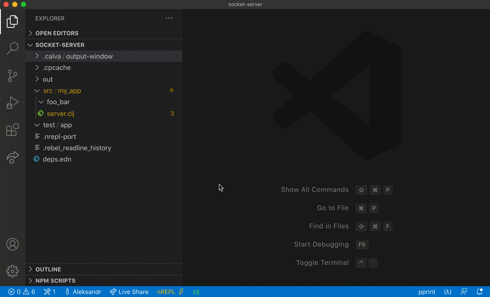

# NS Name Deriving

When you create a new clojure file, a file with `.clj`, `.cljc` or `.cljs` extension, Calva tries to derive namespace name for it and put an appropriate ns form in a place.

Note the cursor is placed right before the closing parenthesis. So if you want to require something, just hit the Enter and start typing it.

## How It Works

Currently to build a namespace name Calva relies on the classpath. So to get a full namespace name, 2 conditions should be met:

1. You are connected to a nREPL server (Jack-In).
2. A source path under which you're creating a file is included in the classpath.

The latter means if you have a `test` alias in your `deps.edn` and it has `test` extra path in it, then you need to make sure you picked this alias during Jack-In process.

### Fallback

If one of the conditions above is not met, Calva still adds a namespace to the new file. However, in this case it could be inaccurate. For example, if you create a file `your-app/test/app/core_test.clj` and `your-app/test` directory is not in your classpath, you will get simply `(ns core-test)` instead of `(ns app.core-test)`.
